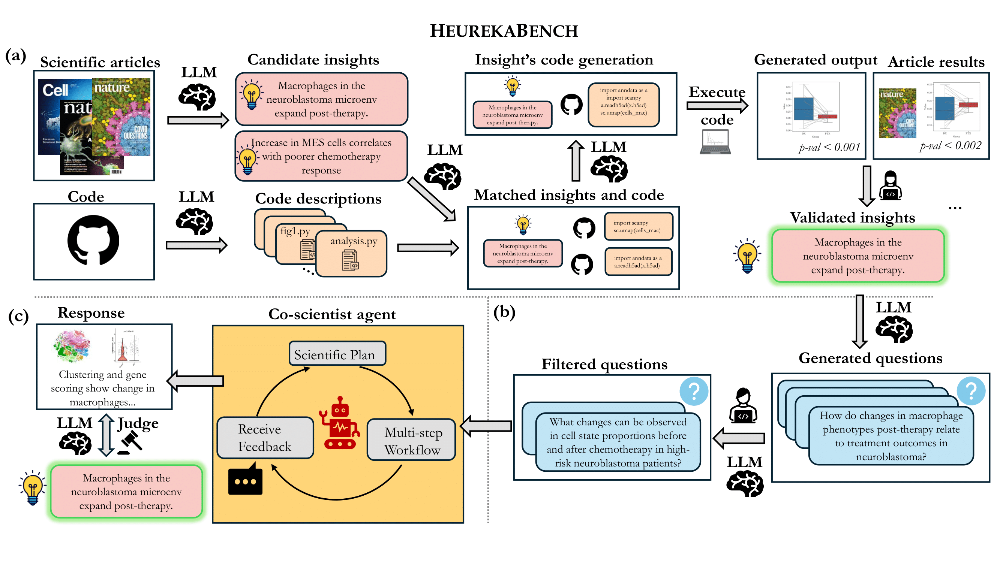

# HeurekaBench: A Benchmarking Framework for AI Co-scientist

[](https://brbiclab.epfl.ch/projects/heurekabench/)
[](#)
[](https://github.com/mlbio-epfl/HeurekaBench)
[](#citation)

**[Siba Smarak Panigrahi*](https://sibasmarak.github.io/)** · **[Jovana Videnović*](https://scholar.google.com/citations?user=ShYOPIkAAAAJ)** · **[Maria Brbić](https://brbiclab.epfl.ch/team/)**

---
---

`heurekabench` is a framework to create benchmarks with exploratory, open-ended research questions on experimental datasets for AI co-scientists. Each question in the benchmark is grounded in a scientific study and its corresponding code repository, and is created using a semi-automated pipeline that leverages multiple LLMs to extract insights and generate candidate workflows, which are then verified against reported findings. An instantiation of this framework is sc-HeurekaBench, available in `scheurekabench`, for benchmarking AI co-scientists in the single-cell domain.

# Overview of the Framework
<p align="center">
  
</p>

The framework consists of three stages:   
- **(a) insight generation**: where candidate insights are extracted from scientific articles and semi-automatically validated  
- **(b) question generation**: where validated insights are reformulated as question-answer pairs   
- **(c) question solving**: where the agent autonomously designs and executes a multi-step analysis, producing a data-driven answer that is evaluated against published findings.  

More details on the framework and creating new benchmarks in other scientific domainsare provided in the [Extending HeurekaBench to other domains for creating new benchmarks](#Extending-HeurekaBench-to-other-domains-for-creating-new-benchmarks) section below.

# Evaluating your AI agent on the sc-HeurekaBench benchmark
To evaluate, the agent is provided with the questions from the benchmark and has to autonomously design and execute a multi-step analysis to produce a data-driven answer that is evaluated against published findings. Below, we provide instructions on how to get the single-cell datasets and then how to adapt existing single-cell agents as AI Co-scientists to solve the tasks in the `scheurekabench` benchmark. The benchmark questions and answers are available in the `scheurekabench/benchmark/mcq.json` and `scheurekabench/benchmark/oeq.json` files.

All versions of the benchmark are listed below:
```
scheurekabench/benchmark/
  |- scdata (data folder with all the single-cell datasets and additional files, e.g., .txt, .csv, etc.)
  |- mcq_lite.json (multiple-choice questions, lite-version for computationally expensive agents)
  |- mcq.json (multiple-choice questions, full-version)
  |- mcq_tu.json (multiple-choice questions that require specific tool usage)
  |- oeq_lite.json (open-ended questions, lite-version)
  |- oeq.json (open-ended questions, full-version)
  |- oeq_tu.json (open-ended questions that require specific tool usage)
```

## Getting the single-cell datasets
All the single-cell datasets should be stored in the `scheurekabench/benchmark/scdata` folder. The single-cell datasets (`.h5ad`, `.txt`, `.csv`, etc.) are available [here](https://drive.google.com/drive/folders/1qRPW4P_Un0Pjm4Pbakvk1KhZdNiww22g?usp=sharing) in a compressed manner. Please follow the instructions below to download and extract the datasets:

You should have all of the following in the same directory (ideally at the root of the project):

- `scdata.part_[aa-af]`
- `scdata.tar.zst.sha256`

---

```bash
# Reassemble the archive
cat scdata.part_* > scdata.tar.zst 

# Verify the integrity of the archive
# Expected output: scdata.tar.zst: OK
sha256sum -c scdata.tar.zst.sha256

# Optional: Verify the integrity of the archive using zstd
zstd -t scdata.tar.zst

# Extract the datasets (will automatically extract to `scheurekabench/benchmark/scdata/`)
# You can check the size after extraction with `du -sh scheurekabench/benchmark/scdata/` which should be 44 GB
tar -I zstd -xf scdata.tar.zst

# Optional: Clean up the files
rm scdata.part_* scdata.tar.zst

# Mandatory: give read permissions to the `scheurekabench/benchmark/scdata/` folder to all users
chmod -R a+r scheurekabench/benchmark/scdata/
```

## Running AI agents
> **Note:** The paths in the datasets should contain the absolute paths otherwise the agent sometimes fails to find the data files if it is relative paths. We recommend to append absolute path to the `data` keys in `scheurekabench/benchmark/oeq.json` and `scheurekabench/benchmark/mcq.json` files.

The first task is to create a `.env` file in the root directory of the project. An example file is provided in the [.env.example](.env.example) file. You can copy it and rename it to `.env`. 

### Creating an environment with the required packages
Create a conda environment with the required packages mentioned below. If you identify some packages missing, please create a pull request to add them and we will update the following instructions accordingly.
```bash
conda create -n heurekabench python=3.12
conda activate heurekabench
pip install vllm=0.11.0
pip install python-dotenv PyMuPDF openai anthropic nbformat
```

### Running LLMs without access to agent environment
To run open-source LLMs without access to an agent environment, you can use the following command. To run closed-source LLMs, you can use the same command but replace `run_open_llms.py` with `run_closed_llms.py` below.

```bash
cd scheurekabench
python run_baselines/run_open_llms.py \
    --dataset_json_path <path_to_dataset_json_file> \
    --output_dir <path_to_output_dir> \
    --llm_name <LLM_name> \
    --q_type <question_type: mcq|oe>
```
### Running CellVoyager baseline
To run CellVoyager baseline, you can use the following command:

```bash
cd scheurekabench/run_baselines/CellVoyager
python run_cellvoyager.py \
    --dataset_json_path <path_to_dataset_json_file> \
    --output_dir <path_to_output_dir> \
    --cellvoyager_llm claude-sonnet-4-20250514 \
    --q_type <question_type: mcq|oe>
```
### Running Biomni with Different Models
> **Note:** We provide the adaptation of Biomni version 0.0.6 for the following experiments. The original Biomni repository is available at [here](https://github.com/snap-stanford/Biomni) and newer versions can be merged appropriately.

#### Running Closed-Source LLMs

To run Biomni with closed-source LLMs, you can use the following command:

```bash
cd scheurekabench
python run_biomni/run_biomni.py \
    --dataset_json <path_to_dataset_json_file> \
    --biomni_llm <LLM_name: claude-sonnet-4-20250514|gpt-4o> \
    --q_type <question_type: mcq|oe> \
    --output_dir <path_to_output_dir>
```

#### Running Open-Source LLMs

First, start a vLLM server with the desired LLM (e.g., to serve `openai/gpt-oss-120b` with 4 GPUs):

```bash
vllm serve openai/gpt-oss-120b \
  --port 8000 \
  --tensor-parallel-size 4
```
Before running Biomni, we have to set `biomni_e1` environment following the official instructions [here](https://github.com/snap-stanford/Biomni/tree/main/biomni_env). Then `conda activate biomni_e1` to activate the environment.

Followed by this, use the following command to run Biomni with the open-source LLM (with the correct `--biomni_llm` and `--biomni_base_url`):

```bash
cd scheurekabench
python run_biomni/run_biomni.py \
    --dataset_json <path_to_dataset_json_file> \
    --output_dir <path_to_output_dir> \
    --biomni_llm <LLM_name: openai/gpt-oss-120b> \
    --biomni_source Custom \
    --biomni_base_url http://0.0.0.0:8000/v1 \
    --q_type <question_type: mcq|oe>
    --temperature <temperature>
```

### Evaluation Workflow: Obtain correctness scores

Once the agent has produced outputs, we first extract the solutions from the agent outputs with the following command:
```bash
python extract_agent_answer.py --root_dir <path_to_agent_outputs>
```
> **Note:** Some agent runs might have not produced appropriate outputs (e.g., <solution></solution> tags do not contain the solution because the agent stopped prematurely, or segmentation fault occurred, no response between <solution> and </solution> tags, etc.). In such cases, it is recommended to re-run the agent by deleting the output files for those questions, otherwise GPT-4o judge will not assign meaningful scores to such outputs.

After extracting the solutions (which will be located in the `<root_dir>/processed_results.json` file), we can run the evaluation with the following command:

```bash
python evaluate_agent_answer.py \
    --dataset_json <path_to_dataset_json_file> \
    --results_json <path_to_processed_results.json> \
    --q_type <question_type: mcq|oe>
```

There is an option to use batch processing for open-ended question evaluation (to batch the requests to the GPT API). To use batch processing, add the `--batch_oe_judge` flag to the command.

Finally, the evaluation results and associated files will be found within the `<root_dir>` directory.


# Extending HeurekaBench to other domains for creating new benchmarks

Our proposed HeurekaBench framework can be used to create a benchmark for any scientific domain with experimental datasets. We provide an instantiation of the framework for the single-cell biology domain, sc-HeurekaBench. All relevant scripts for benchmark creation are available in the [`scheurekabench`](scheurekabench) folder. To avoid overwhelming this README, we have provided the details in its own [`README`](scheurekabench/README.md) file.

# Citation
If you find this work useful, please cite our paper:

```
```